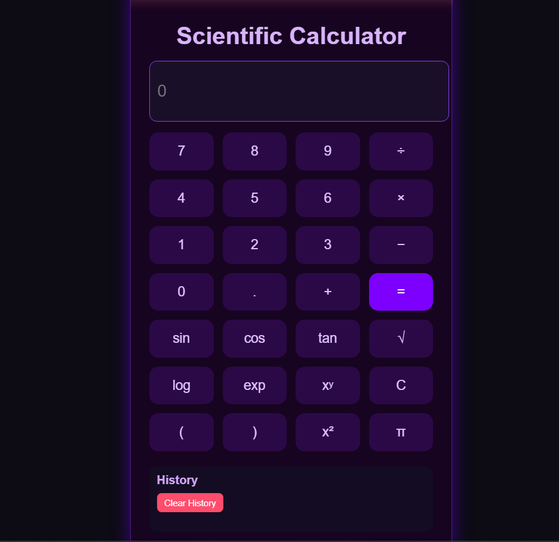
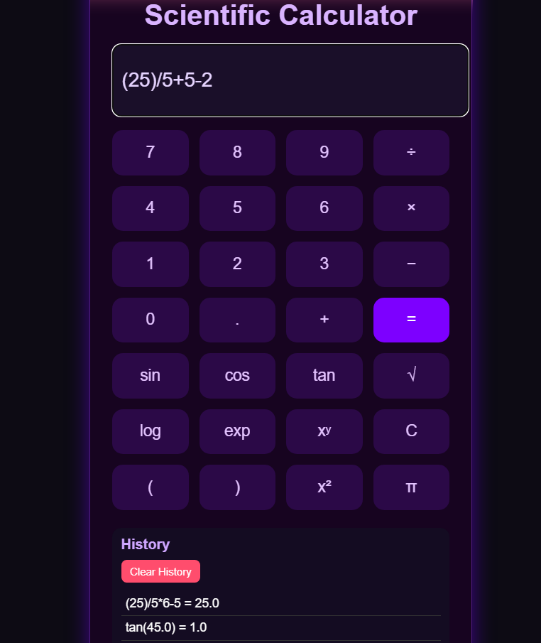
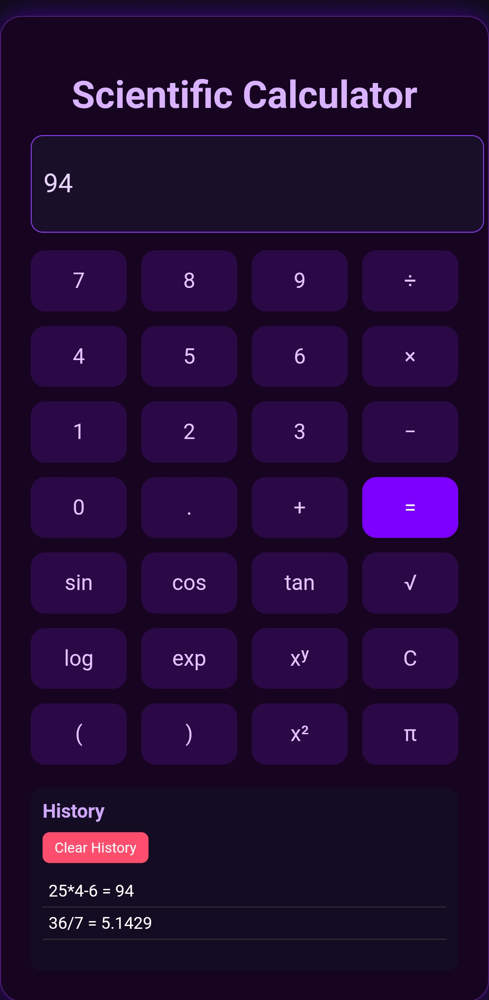

# 🔬 Scientific Calculator (Flask)

A modern web-based scientific calculator built using Python and Flask, featuring a clean UI and support for both basic and advanced mathematical operations.

---

## 📌 About

This project is a full-stack web calculator designed to perform both basic arithmetic and scientific calculations.  
It also includes a history feature to track previous computations.

The goal of this project was to understand how frontend and backend interact while building a functional web application.

---

## ✨ Features

- Basic operations: +, −, ×, ÷  
- Scientific functions:
  - sin, cos, tan  
  - square root (√)  
  - logarithm (log)  
  - exponential (exp)  
  - power (xʸ)  
- Keyboard support  
- Calculation history  
- Clear display & clear history functionality  
- Clean and responsive UI  

---

## 📸Screenshots




---

## 🛠️ Technologies Used

- Python 🐍  
- Flask 🌐  
- PostgreSQL with SQLAlchemy 🗄️
- HTML, CSS, JavaScript  

---

## 🚀 How to Run

### 1️⃣ Clone the repository:
```bash
git clone https://github.com/your-username/calculator.git
```
### 2️⃣ Navigate to the project folder:
```bash
cd Flask_Calcu
```
### 3️⃣ Install dependencies:
```bash
pip install -r requirements.txt
```
### 4️⃣ Configure environment variables:

Copy `.env.example` to `.env` and set a long random `SECRET_KEY`.
Leave `DATABASE_URL` empty for local SQLite, or set it to a PostgreSQL URL
for deployment.

### 5️⃣ Apply database migrations:

```bash
flask --app Calc.app db upgrade
```

Local SQLite data is stored at `instance/calculator.db`. Create schema changes
with Flask-Migrate and commit the generated migration; do not edit the
database file directly.

### 6️⃣ Run the application:
```bash
flask --app Calc.app run
```
### 7️⃣ Open in browser:
```bash
http://127.0.0.1:5000/
```

The deployment command applies `db upgrade` before Gunicorn starts. The
`/health` endpoint checks database connectivity and returns HTTP 200 only
when the application can reach its database.

---

### 🧠 Key Learnings
- Handling user input using JavaScript
- Connecting frontend with Flask backend
- Implementing mathematical logic in Python
- Managing application state and history
- Building interactive UI components

---

### 📈 Future Improvements
- Add memory functions (M+, M-, MR)
- Improve UI/UX design
- Add dark/light theme toggle
- Store history persistently (database/local storage)
- Add more advanced math functions

---

🔗Connect with me - www.linkedin.com/in/austinn-dsouza

🔴Live link - https://flask-projects-2e73.onrender.com

---

### 📌 Note

This project is part of my learning journey in web development and will continue to evolve with new features and improvements.

⭐ Feel free to explore and use the project!
